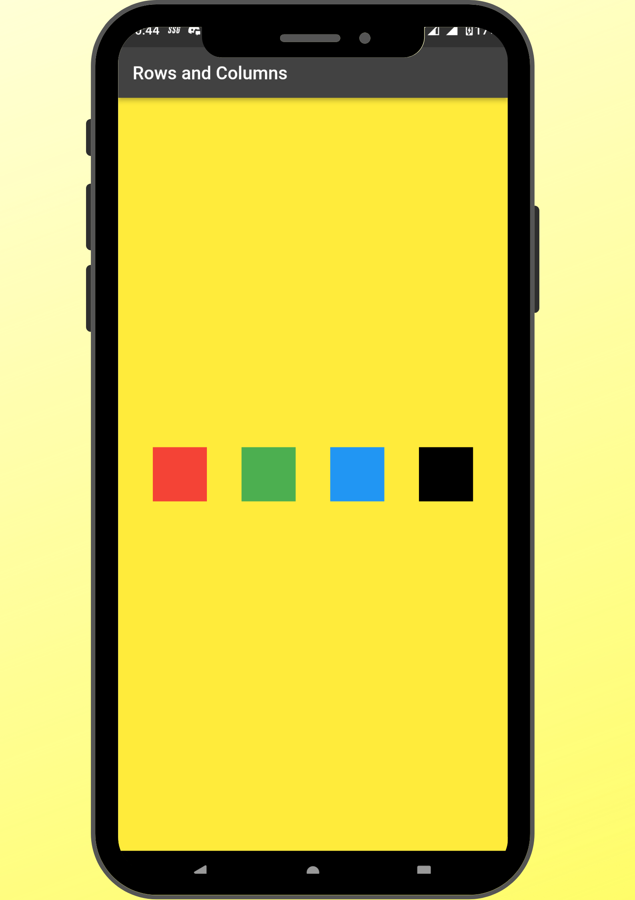

<h1 align="center">Flutter App Dev by Amit 🚀</h1>
<h4 align="center">Various Flutter App 📱 built using Dart in Android Studio .</h4>

 
<h1 align="center">⚙️ Technology Used</h1>
 </a>  <a href="https://www.java.com" target="_blank">  

<h1 align="center">📸 Apps</h1>
  
||||
|:----------------------------------------:|:-----------------------------------------:|:-----------------------------------------: |
|01|02|03-A|
|  |  |  | 
|03-B|04-A|04-B|
|  |  |  | 
  
  
  
<h1 align="center">🙍‍♂️ Contact Me</h1>
  
<h1 align="center"></h1>
<h1 align="center"></h1>
<h1 align="center"></h1>
