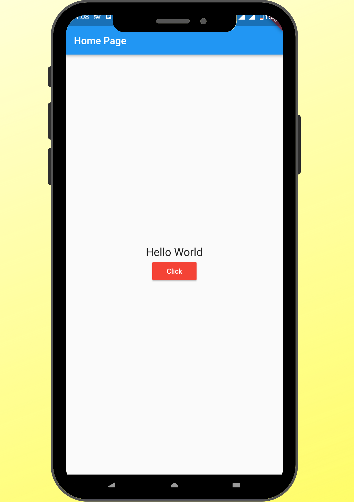

<h1 align="center">Flutter App Dev using Dart by Amit 🚀</h1>

 
<h1 align="center">⚙️ Technology Used</h1>

|||
|:----------------------------------------:|:-----------------------------------------:|
|  </a> <a href="https://www.java.com" target="_blank"> |  </a> <a href="https://www.java.com" target="_blank">  |

<h1 align="center">📸 Apps Demo</h1>
  
||||
|:----------------------------------------:|:-----------------------------------------:|:-----------------------------------------: |
|01|02|03-A|
|  |  |  | 
|03-B|04-A|04-B|
|  |  |  | 
|05|06-A|06-B|
|  |  |  | 
|07|08|09|
|  |  |  | 
|10|11|12|
|  |  |  | 
|13|14|15-a|
|  |  |  | 
|15-b|16|17|
|  |  |  | 
|18|19|20|
|  |  |  | 
|pr-01|pr-02|pr-03|
|  |  |  | 
|pr-04|pr-02|pr-03|
|  |  |  | 
  
  
   
  
   
  
  <h1 align="center">🔗 Important Link </h1>
  
  [1. Flutter 30 Days 30 Concepts](https://www.youtube.com/playlist?list=PL9n0l8rSshSmiu8ddKebcKCltDfppDkEd)
  
   
   
  
<h1 align="center">🙍‍♂️ Contact Me</h1>
  

  
  

 
  
    
